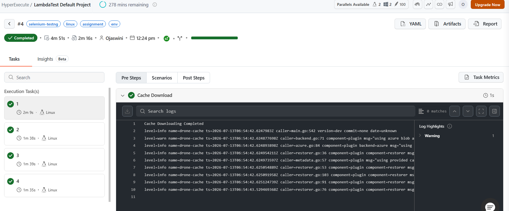
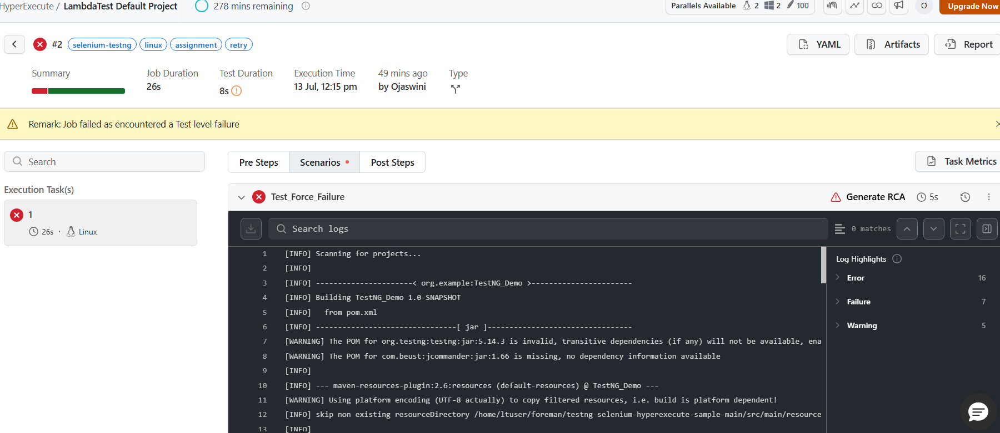

# HyperExecute SE Assignment

This repository contains my completed HyperExecute Solutions Engineer technical assignment using the LambdaTest/TestNG Selenium HyperExecute sample project.

Detailed task notes, commands, log evidence, and dashboard links are in [`SUBMISSION.md`](SUBMISSION.md).

## Assignment Deliverables

| Task | What was added/changed | Evidence |
| --- | --- | --- |
| Task 1: Fix broken YAML | Added fixed Linux HyperExecute YAML at `yaml/linux/v1/hyperexecute_assignment_task1_task2.yaml` | Successful dashboard job and notes in `SUBMISSION.md` |
| Task 2: Environment variables | Added `ENVIRONMENT: staging` in YAML, printed it in pre-steps, and read it from Java using `System.getenv` in `Test1.java` | Pre-step and TestNG log evidence in `SUBMISSION.md` |
| Task 3: Force failure and retries | Added `ForceFailureTest.java`, retry suite XML, and retry YAML at `yaml/linux/v1/hyperexecute_assignment_task3_retry.yaml` | Failed retry job and retry evidence in `SUBMISSION.md` |
| Task 4: Linux/Unix basics | Added `assignment-sample.log` and documented `grep`, `awk`, `sed`, and piped commands | Commands and sample output in `SUBMISSION.md` |

## Key Files

- `SUBMISSION.md` - final assignment write-up with task notes and evidence.
- `yaml/linux/v1/hyperexecute_assignment_task1_task2.yaml` - fixed YAML for the successful HyperExecute run and environment-variable task.
- `yaml/linux/v1/hyperexecute_assignment_task3_retry.yaml` - retry YAML for the intentional failure test.
- `src/test/java/Test1.java` - reads and prints `ENVIRONMENT` from inside a TestNG test.
- `src/test/java/ForceFailureTest.java` - intentionally fails to validate `retryOnFailure`.
- `xml/testng_assignment_retry_linux.xml` - TestNG suite for the forced failure test.
- `assignment-sample.log` - sample file used for Linux/Unix command examples.

## Evidence Screenshots

### Task 1 and Task 2: Successful HyperExecute Job

This job used the fixed Linux YAML and completed successfully with 4 autosplit tasks.



Dashboard link: https://hyperexecute.lambdatest.com/hyperexecute/task?jobId=67668873-ae72-436d-841d-3af646aad4ff

### Task 3: Intentional Failure and Retry Job

This job intentionally fails through `ForceFailureTest.java`. The retry proof is documented in `SUBMISSION.md` with the CLI evidence showing `{retry 1} Test_Force_Failure`.



Dashboard link: https://hyperexecute.lambdatest.com/hyperexecute/task?jobId=0463a85b-2b9d-4137-ab35-42dc4b2f560e

## How To Run

Set LambdaTest credentials as environment variables before running. Credentials are not committed to this repository.

```bash
export LT_USERNAME="YOUR_USERNAME"
export LT_ACCESS_KEY="YOUR_ACCESS_KEY"
```

Run Task 1 and Task 2:

```bash
./hyperexecute --config yaml/linux/v1/hyperexecute_assignment_task1_task2.yaml --force-clean-artifacts --download-artifacts
```

Run Task 3:

```bash
./hyperexecute --config yaml/linux/v1/hyperexecute_assignment_task3_retry.yaml --force-clean-artifacts --download-artifacts
```

## Summary Of Fixes

- Aligned the YAML with the Linux TestNG suite and Java 11 runtime.
- Used static autosplit discovery entries for the known TestNG test names.
- Passed each discovered test into Maven using `-DselectedTests=$test`.
- Used `-Dplatname=linux` so Maven resolves `xml/testng_linux.xml`.
- Added a custom `ENVIRONMENT` variable and validated it from both HyperExecute pre-steps and Java test execution.
- Added an intentional hard failure and enabled `retryOnFailure` with `maxRetries: 1`.
- Added documented Linux command examples for `grep`, `awk`, `sed`, and a pipe chain.

# Run Selenium Tests with TestNG on HyperExecute by TestMu AI (Formerly LambdaTest)

<p align="center">
  <a href="https://www.testmuai.com/"></a>
  <a href="https://search.maven.org/artifact/org.testng/testng"></a>
  <a href="https://community.testmuai.com/"></a>
</p>

## Getting Started

[TestMu AI](https://www.testmuai.com/) (Formerly LambdaTest) is the world's first full-stack AI Agentic Quality Engineering platform that empowers teams to test intelligently, smarter, and ship faster. Built for scale, it offers a full-stack testing cloud with 10K+ real devices and 3,000+ browsers. With AI-native test management, MCP servers, and agent-based automation, TestMu AI supports Selenium, Appium, Playwright, and all major frameworks. 

With TestMu AI (Formerly LambdaTest), you can run Java TestNG Selenium tests at scale using HyperExecute smart test orchestration. This sample shows how to configure Java + TestNG with HyperExecute to run on the TestMu AI cloud.

- [Sign up on TestMu AI](https://www.testmuai.com/register/) (Formerly LambdaTest).
- Follow the [TestMu AI Documentation](https://www.testmuai.com/support/docs/) for the full setup walkthrough.

### Prerequisites

- Java JDK 11 or higher, Maven (latest stable). Download the HyperExecute CLI from https://downloads.lambdatest.com/hyperexecute/
- A TestMu AI (Formerly LambdaTest) account with your username and access key

### Setup

Clone and install dependencies:

```bash
git clone https://github.com/LambdaTest/testng-selenium-hyperexecute-sample && cd testng-selenium-hyperexecute-sample
mvn -Dmaven.test.skip=true clean install
```

Set your credentials as environment variables.

**macOS / Linux:**

```bash
export LT_USERNAME="YOUR_USERNAME"
export LT_ACCESS_KEY="YOUR_ACCESS_KEY"
export LT_TUNNEL="YOUR_TUNNEL_NAME"
```

**Windows:**

```bash
set LT_USERNAME="YOUR_USERNAME"
set LT_ACCESS_KEY="YOUR_ACCESS_KEY"
set LT_TUNNEL="YOUR_TUNNEL_NAME"
```

### Run tests

On Windows:

```bash
./hyperexecute --config yaml/win/testng_hyperexecute_autosplit_sample.yaml --force-clean-artifacts --download-artifacts
```

On Linux:

```bash
./hyperexecute --config yaml/linux/testng_hyperexecute_autosplit_sample.yaml --force-clean-artifacts --download-artifacts
```

View results on your TestMu AI dashboard.

### Local testing with TestMu AI Tunnel

To test locally hosted apps, set up the TestMu AI tunnel. OS-specific guides:

- [Local Testing on Windows](https://www.testmuai.com/support/docs/local-testing-for-windows/)
- [Local Testing on macOS](https://www.testmuai.com/support/docs/local-testing-for-macos/)
- [Local Testing on Linux](https://www.testmuai.com/support/docs/local-testing-for-linux/)

Add the following to your capabilities:

```yaml
tunnel: true
```

## Contributions

Contributions are welcome. Open an issue to discuss your idea before submitting a pull request. When reporting bugs, include your Java version, OS, and TestNG version.

## TestMu AI (Formerly LambdaTest) Community

Connect with testers and developers in the [TestMu AI Community](https://community.testmuai.com/). Ask questions, share what you are building, and discuss best practices in test automation and DevOps.
  
## TestMu AI (Formerly LambdaTest) Certifications

Earn free [TestMu AI Certifications](https://www.testmuai.com/certifications/) for testers, developers, and QA engineers. Validate your skills in Selenium, Cypress, Playwright, Appium, Espresso and more. Industry-recognized, shareable on LinkedIn, and built by practitioners, not marketers.

## Learning Resources by TestMu AI (Formerly LambdaTest)

Learn modern testing through tutorials, guides, videos, and weekly updates:

* [TestMu AI Blog](https://www.testmuai.com/blog/)
* [TestMu AI Learning Hub](https://www.testmuai.com/learning-hub/)
* [TestMu AI on YouTube](https://www.youtube.com/@TestMuAI)
* [TestMu AI Newsletter](https://www.testmuai.com/newsletter/)
  
## LambdaTest is Now TestMu AI

On **January 12, 2026**, [LambdaTest evolved to TestMu AI](https://www.testmuai.com/lambdatest-is-now-testmuai/), the world's first fully autonomous **Agentic AI Quality Engineering Platform**.

Same team. Same infrastructure. Same customer accounts. All existing LambdaTest logins, scripts, capabilities, and integrations continue to work without change.

👉 Find the new home for [LambdaTest](https://www.testmuai.com).

### How LambdaTest Evolved into TestMu AI

In 2017, we launched LambdaTest with a simple mission: make testing fast, reliable, and accessible. As LambdaTest grew, we expanded into Test Intelligence, Visual Regression Testing, Accessibility Testing, API Testing, and Performance Testing, covering the full depth of the testing lifecycle.

As software development entered the AI era, testing had to evolve, too. We rebuilt the architecture to be AI-native from the ground up, with autonomous agents that **plan, author, execute, analyze, and optimize tests** while keeping humans in the loop. The platform integrates with your repos, CI, IDEs, and terminals, continuously learning from every code change and development signal.

That evolution earned a new name: **TestMu AI**, built for an AI-first future of quality engineering. TestMu is not a new name for us. It is the name of our annual community conference, which has brought together 100,000+ quality engineers to discuss how AI would reshape testing, long before that became an industry norm. 

What started as a high-performance cloud testing platform has transformed into an AI-native, multi-agent system powering a connected, end-to-end quality layer. That evolution defined a new identity: LambdaTest evolved into TestMu AI, built for an AI-first future of quality engineering.

## Support

Got a question? Email [support@testmuai.com](mailto:support@testmuai.com) or chat with us 24x7 from our chat portal.
